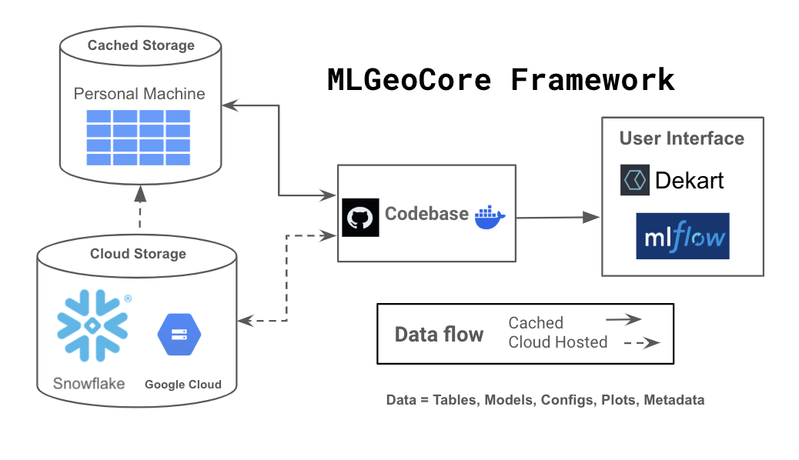

# GeoCore 

#TODO: update the figure


## What is GeoCore? 

GeoCore is a Python library for geospatial Machine Learning.


## Installation
### With docker (recommended)

Build the docker image 
```bash
docker build -f dockerfiles/cpu/Dockerfile -t geocore-cpu .
```

### Without docker

1. Install [poetry](https://python-poetry.org/docs/#installation)

2. Create the poetry environment with `poetry install`

## Usage
The commands below allows the user to run an experiment on the [Ingenious dataset](https://gdr.openei.org/submissions/1391).

First, create a [free Snowflake account](https://signup.snowflake.com/) and set the Snowflake parameters:
```bash
export SNOWFLAKE_USER=XXX
export SNOWFLAKE_PASSWORD=XXX
export SNOWFLAKE_ACCOUNT=XXX # find value here https://docs.snowflake.com/en/user-guide/gen-conn-config#using-sql-statements-to-find-your-account-identifier
```

Then run an experiment with:
```bash
poetry run train -c experiment_configs/lightgbm_gbdt_model_ingenious.yaml -e experiment_0
```


## Citing
`GeoCore` was developed by [Zanskar Geothermal and Minerals](https://www.zanskar.com/).

We encourage you to cite references to this code as: 

`Smith, C., Hossler, T.,  Lipscomb, J., Morrison, R., and Grujic, O. (2024). An efficient and scalable framework to optimize geospatial machine learning. PROCEEDINGS, 50th Workshop on Geothermal Reservoir Engineering Stanford University, Stanford, California, February 10-12, 2025 SGP-TR-229`

We welcome feedback, bug reports and code contributions from third parties.

Main contributors:

* Thomas Hossler [@defqoon](https://github.com/defqoon)
* Ognjen Grujic [@ogru](https://github.com/ogru)
* Connor Smith [@conster303](https://github.com/conster303)
* Jacob Lipscomb [@jakezanskar](https://github.com/jakezanskar)
* Rachel Morrison  [@rmorrison24](https://github.com/rmorrison24)


## License

The source code of this project is licensed under the [MIT License](https://opensource.org/license/mit). 
